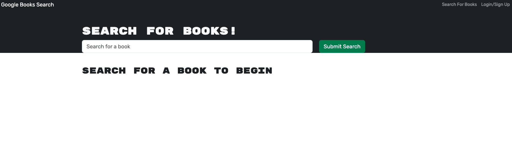

# Library Search

## Description 


## Table of Contents
-[User Story](#User-Story)

-[Acceptance Criteria](#Acceptance-Criteria)

-[My Successes and Challenges](#My-Successes-and-Challenges)

-[Links](#Links)

-[Screenshots](#Screenshots)

-[Credits](#Credits)

## User Story
```md
AS AN avid reader
I WANT to search for new books to read
SO THAT I can keep a list of books to purchase
````

## Acceptance Criteria
```md
GIVEN a book search engine
WHEN I load the search engine
THEN I am presented with a menu with the options Search for Books and Login/Signup and an input field to search for books and a submit button
WHEN I click on the Search for Books menu option
THEN I am presented with an input field to search for books and a submit button
WHEN I am not logged in and enter a search term in the input field and click the submit button
THEN I am presented with several search results, each featuring a book’s title, author, description, image, and a link to that book on the Google Books site
WHEN I click on the Login/Signup menu option
THEN a modal appears on the screen with a toggle between the option to log in or sign up
WHEN the toggle is set to Signup
THEN I am presented with three inputs for a username, an email address, and a password, and a signup button
WHEN the toggle is set to Login
THEN I am presented with two inputs for an email address and a password and login button
WHEN I enter a valid email address and create a password and click on the signup button
THEN my user account is created and I am logged in to the site
WHEN I enter my account’s email address and password and click on the login button
THEN I the modal closes and I am logged in to the site
WHEN I am logged in to the site
THEN the menu options change to Search for Books, an option to see my saved books, and Logout
WHEN I am logged in and enter a search term in the input field and click the submit button
THEN I am presented with several search results, each featuring a book’s title, author, description, image, and a link to that book on the Google Books site and a button to save a book to my account
WHEN I click on the Save button on a book
THEN that book’s information is saved to my account
WHEN I click on the option to see my saved books
THEN I am presented with all of the books I have saved to my account, each featuring the book’s title, author, description, image, and a link to that book on the Google Books site and a button to remove a book from my account
WHEN I click on the Remove button on a book
THEN that book is deleted from my saved books list
WHEN I click on the Logout button
THEN I am logged out of the site and presented with a menu with the options Search for Books and Login/Signup and an input field to search for books and a submit button 
````

## Successes and Challenges
A success was being able to get my log in functions working and the search input to display the books I wanted to look up seemlessly, I didn't have much difficulty on that. A challenge was being able to deploy the website with Heroku using Mongo Atlas. I will continue to try to successfully deploy my application.

## Links
Github: https://github.com/Allicris/library-search
Website link: https://library-search11-40b9725da4f8.herokuapp.com/
Video Link: https://drive.google.com/file/d/1hUv_NMGvgdLrZML9OqZGCNTJV4s0ilYM/view

## User Interface
### Home Page

### Log in

### Search Books

### Saved Books


## Credits
I would like to give credit to my bootcamp tutor, Jeyyun Jung, he helped me fix a few bugs and also helped me getting started on deploying the website. I would also like to give credit to randiferous on Github, this is mostly his code and it gave me a great understandong of how to work with a MERN application. 